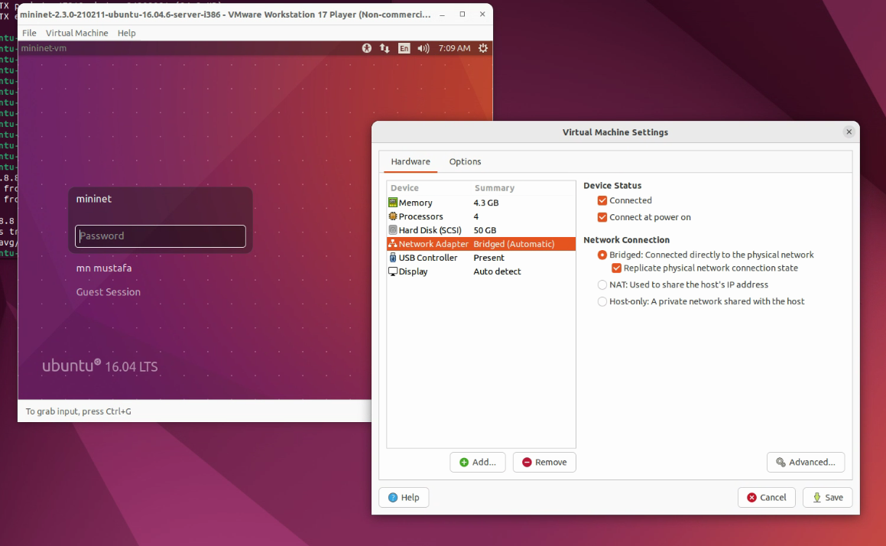
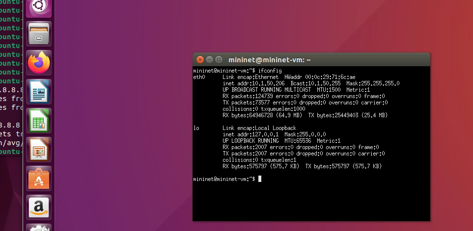
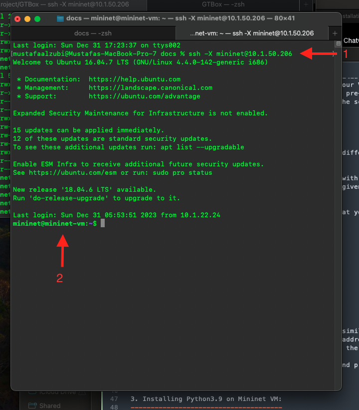

Installation: 
=============

As a comprehensive DDoS security box designed for the scientific research community, GTBox necessitates the installation of multiple software packages on your system. Following the instructions on this page will facilitate and expedite the installation process: 

1. Installing Mininet: 
----------------------
As indicated in Mininet website "http://mininet.org/download/" (*"The easiest way to get started is to download a pre-packaged Mininet/Ubuntu VM. This VM includes Mininet itself, all OpenFlow binaries and tools pre-installed, and tweaks to the kernel configuration to support larger Mininet networks."*)

1. For easy of reference, latest Mininet VM can be found here: https://github.com/mininet/mininet/releases/
2. Instructions on how to run the VM on your system can be found here: http://mininet.org/download/
3. You can go through the *walkthrough* to become familiar with Mininet commands and their common usage, here it is: http://mininet.org/walkthrough/ 
4. To enhance the connectivity and accessibility of your VM within your network, it is advisable to switch from the default Network Address Translation (NAT) setting to a bridged network configuration. By default the VM is pre-configured with NAT. This change will allow the VM to appear as a separate entity on your network, making it more accessible and interactive with other devices. The screenshot below shows you how to change the settings on VMWare Player: 

   Bridge settings in VMWare Player. It may slightly differ in other systems i.e. Oracle VM. However, the principles and context remain consistent across different virtualization platforms.

5. Login to Mininet VM, it is already pre-configured with username and password ->  **mininet** for both of them. 
6. Run the terminal and check the IP address that is given to the VM using ``ifconfig`` command: 

.. note:: DHCP
	These instructions are based on the assumption that you have a DHCP server in operation, and assigning IP addresses to clients

   Make sure that the VM acquired an IP address

2. SSH access to Mininet VM: 
-----------------------------

1. Open Your SSH Client: On Windows, open PuTTY or a similar SSH client. On macOS or Linux, open the Terminal.
2. Connect via SSH: In your SSH client, enter the IP address of the Mininet VM -- see the figure below, arrow number **1** -- , default port is 22. 
3. When prompted, enter the username and password for the Mininet VM, default is ``mininet`` for both of them. 
4. Verify that you are connected. -- see the figure below, arrow number **2** --

   Connection to Mininet VM from Mac OS Terminal (this is similar to linux OS or any linux like system)

5. In reference to the figure above, you will notice that ``-X`` is used as a connection option. This enables X11 forwarding. X11 forwarding allows you to run graphical applications on a remote server and have their graphical user interfaces (GUIs) displayed on your local machine.

3. Installing and configuring Samba server: 
-------------------------------------------

3. Installing Python3.9 on Mininet VM: 
--------------------------------------
Python 3.5 is al

