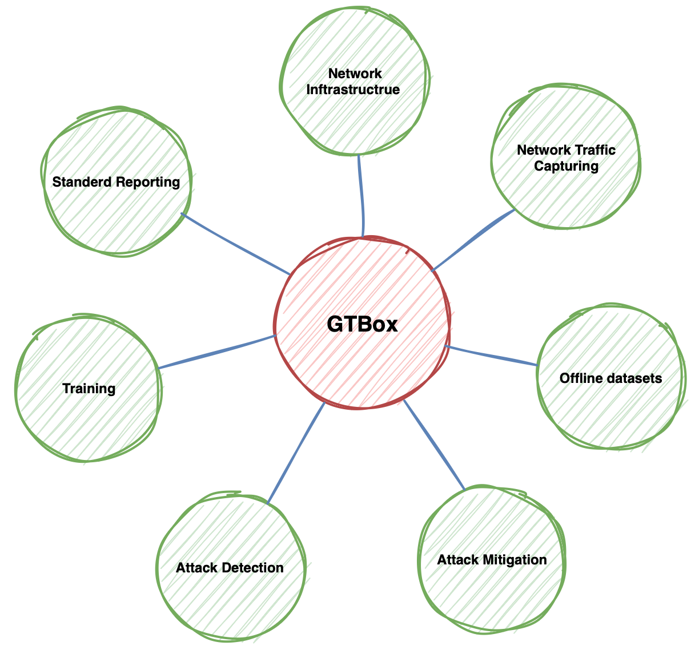

Introduction to GTBox
=====================

GTBox is an ecosystem framework, combining a suite of our own developed modules and software packages with other open-source tools like Mininet, Wireshark, Hping3, ..etc. This powerful mix is designed to **streamline and professionalize** the research process. 

.. Why GTBox::
   To understand/get the idea well: Imagine you're a researcher keen on exploring DDoS attack detection and mitigation through machine      learning. With GTBox, you can experiment with different datasets, techniques, and models. It also allows you to benchmark your own       model with similar works. In short, GTBox is the go-to tool for researchers seeking to advance their work with efficiency and            precision. 

Describe the structure here!

   GTBox: main components

The main components of GTBox are listed and described in the next section:

GTBox Components
================
   
- Network Infrastructure
- Network Traffic Capturing
- Offline datasets
- Attack Mitigation
- Attack Detection
- Training
- Standard Reporting
